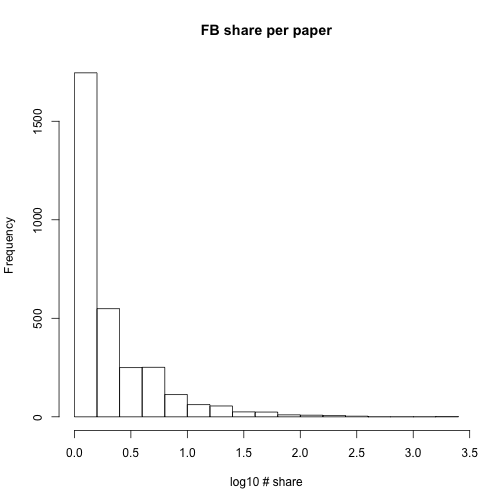

# load the data


# Data exploration

Dist of author count

 

 


The average number of Facebook shares per paper in the data set is 0.6524187

## dplyr


```r
library("dplyr")
```

```
## Warning: package 'dplyr' was built under R version 3.2.2
```

```
## 
## Attaching package: 'dplyr'
## 
## The following objects are masked from 'package:stats':
## 
##     filter, lag
## 
## The following objects are masked from 'package:base':
## 
##     intersect, setdiff, setequal, union
```

```r
research <- filter(count.raw,articleType == "Research Article")
```


